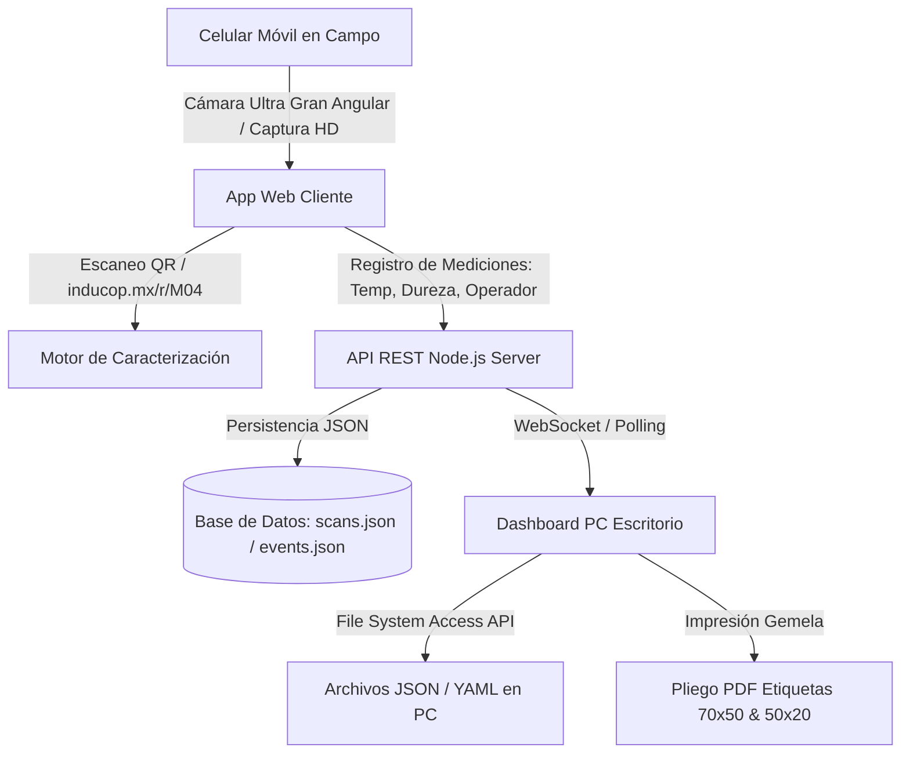

# 📱 Reporte de Proyecto: QR Vision Pro (Fases 1, 2 y 3)

**Fecha de Elaboración**: 2 de Agosto de 2026  
**Proyecto**: Lector & Generador de QR Móvil para Ensayos de Campo (INDUPOX)  
**Ubicación del Código**: `c:\Users\ajmon\proyectos\qr_reader`  
**Repositorio GitHub**: [https://github.com/Entheos69/qr-reader-app.git](https://github.com/Entheos69/qr-reader-app.git)  
**Servidor Nube (Railway)**: [https://qr-reader-app-production.up.railway.app](https://qr-reader-app-production.up.railway.app)  

---

## 📋 Resumen Ejecutivo

Durante esta sesión se diseñó, construyó, desplegó y optimizó el sistema **QR Vision Pro**, una plataforma integral de hardware/software para la lectura, caracterización, bitácora de ensayos y exportación de muestras de laboratorio y campo de **INDUPOX / INDUCOP**.

El sistema resuelve los problemas típicos de escaneo en celulares (enfoque de cámara trasera, conectividad HTTPS) y evoluciona desde un escáner simple hasta una **Plataforma Dinámica de Control de Ensayos** capaz de sincronizar datos en tiempo real entre operarios en campo y la computadora de escritorio.

---

## 🏗️ Arquitectura General del Sistema



### 1. Backend Servidor (Node.js Nativo - 0 Dependencias)
- **Servidor HTTP Ligero**: Construido únicamente con los módulos estándar `http`, `fs` y `path` de Node.js, eliminando problemas de instalación de paquetes externos.
- **Enlace de Puerto Dinámico**: Lee automáticamente `process.env.PORT` para despliegue directo en **Railway**.
- **Endpoints API REST**:
  - `GET /api/scans`: Retorna la lista de escaneos fusionados con sus eventos de bitácora.
  - `POST /api/scans`: Recibe y caracteriza nuevos escaneos o lotes desde el celular.
  - `DELETE /api/scans/:id` & `DELETE /api/scans`: Eliminación individual o total de lecturas.
  - `GET /api/events` & `POST /api/events`: Registro y consulta de mediciones de ensayo.
  - `GET /api/censo` & `POST /api/censo`: Gestor de catálogo de objetos y corridas (CRUD).
  - `POST /api/export`: Generador y exportador de archivos JSON/YAML en el servidor.

---

### 2. Frontend Móvil (Escáner & Registro en Campo)
- **Ubicación**: `public/index.html` y `public/app.js`
- **Diseño Móvil**: Estética *glassmorphic* sobre fondo oscuro con fuentes de Google Fonts (`Outfit` / `Inter`), micro-animaciones láser y respuesta haptic/audio (`Web Audio API`).
- **Enfoque de Cámara de Campo Solucionado**:
  - Selector dinámico de lentes multicámara que identifica y fija automáticamente la **cámara Ultra Gran Angular posterior** (con persistencia en `localStorage`).
  - Botón de **Tomar Foto HD (Cámara Nativa)** (`capture="environment"`) que aprovecha el 100% del hardware de autoenfoque, macro y flash del sistema operativo.
  - Botón **Sincronizar Historial con PC** para transmitir escaneos fuera de línea.
  - Modal **Adosar Evento de Prueba** para registrar temperatura, dureza, observaciones y operador en campo.

---

### 3. Superficie de Consulta en Escritorio (Dashboard PC)
- **Ubicación**: `public/dashboard.html`
- **Métricas KPIs**: Contadores en vivo de lecturas totales, muestras *Operativas (70x50)* e *Identidad (50x20)*.
- **Buscador & Filtros**: Búsqueda por código, tipo, descripción, temperatura o nombre del operador.
- **Acciones por Renglón**:
  - **Eliminar 🗑️**: Borrado individual de renglones.
  - **Exportar JSON / YAML**: Descarga directa al navegador e inserción mediante **File System Access API** (`window.showDirectoryPicker()`) a carpetas de la PC.

---

### 4. Integración del Censo de Objetos INDUPOX Set v2.0
- **Ubicación**: `data/censo_objetos_v2.json`
- Contiene el catálogo completo de **77 objetos oficiales**:
  - **37 Etiquetas Operativas (70x50)**: `M04`, `M08` a `M22`, `A25` a `M32`, `M38` a `M41`, `M45` a `M52`, `M55` (con detalle de peso de resina, endurecedor, arcilla, cizalla y notas de seguridad EPP).
  - **40 Etiquetas de Identidad (50x20)**: `P05` a `P07`, `D13` a `D17`, `F24A/B`, `P33` a `P37`, `U38AC` a `U41TF`, `K44`, `R45` a `R47`, `F42`, `F43`, `F54A/B`, `P56` (probetas, placas de descuelgue, celdas de unión y frascos).

---

### 5. Impresor Aglutinado de Etiquetas PDF
- Pestaña interactiva en el Dashboard para seleccionar cualquier conjunto de objetos del catálogo o corridas nuevas creadas.
- Generación de pliegos oficiales en **par gemelo (Lado Izquierdo: Objeto | Lado Derecho: Hoja del Cuaderno)** con códigos QR vectoriales y reglas CSS `@media print` para exportación a PDF multi-página.

---

## ⏱️ Hitos y Cronología de la Sesión

1. **Fase 1: Creación del Proyecto & Servidor Ligero**
   - Inicialización del proyecto en `c:\Users\ajmon\proyectos\qr_reader`.
   - Creación del servidor nativo `server.js` y script ejecutable `start.bat`.
   - Repositorio Git inicializado y subida a GitHub (`Entheos69/qr-reader-app.git`).
   - Despliegue en Railway con certificado seguro **HTTPS** (obligatorio para la cámara del celular).

2. **Fase 2: Diagnóstico e Investigación de Cámara Trasera**
   - Investigación sobre el comportamiento de multicámaras en Safari/Chrome web.
   - Implementación del selector de lentes físicas que permitió descubrir que la **Cámara Ultra Gran Angular Posterior** es la ideal para escaneo de campo.
   - Implementación del botón de captura con cámara nativa HD (`capture="environment"`).

3. **Fase 3: Sincronización Celular-PC, Bitácora & Exportaciones JSON/YAML**
   - Creación del Dashboard de escritorio (`/dashboard.html`).
   - Integración del catálogo **Censo INDUPOX Set v2.0** (77 objetos).
   - Implementación de la **Bitácora de Eventos de Prueba** (temperatura, dureza, observaciones, operador) adosable desde el celular.
   - Inserción y fusión automática de los campos de campo dentro de la estructura exportada JSON/YAML.
   - Selector de directorio nativo de PC con `window.showDirectoryPicker()` para guardar directamente en cualquier carpeta especificada por el usuario.
   - Creador y compilador de pliegos de etiquetas PDF aglutinadas.

---

## 📄 Estructura Final del Repositorio

```text
c:\Users\ajmon\proyectos\qr_reader\
├── data/
│   ├── censo_objetos_v2.json      (Base de datos del Censo 77 objetos INDUPOX)
│   ├── events.json                (Almacenamiento de Bitácora de Ensayos)
│   └── scans.json                 (Historial centralizado de lecturas)
├── exports/                       (Carpeta destino por defecto para JSON/YAML)
├── public/
│   ├── app.js                     (Lógica cliente móvil, cámara, audio y sync)
│   ├── dashboard.html             (Superficie de consulta PC, CRUD e impresor PDF)
│   ├── index.html                 (Interfaz web móvil del escáner)
│   └── styles.css                 (Sistema de diseño Glassmorphism)
├── .gitignore                     (Exclusiones para Git)
├── package.json                   (Configuración del proyecto Node.js)
├── README.md                      (Guía rápida del usuario)
├── REPORTE_PROYECTO_QR_VISION_PRO.md (Este reporte)
├── server.js                      (Servidor HTTP REST API nativo)
└── start.bat                      (Lanzador local independiente)
```

---

## 💡 Ejemplo de Estructura JSON y YAML Exportada

```yaml
id: "1785726413301"
timestamp: "1785726372319"
date: "09:06 p.m."
dispositivo: "Celular Móvil"
caracterizado: "true"
codigo: "M08"
tipo: "OPERATIVA"
nombre: "Dispersión arcilla 0 %"
corrida: "corrida 8"
composicion: "100.00 g resina + 0.00 g arcilla · blanco"
notas: ""
epp: "EPP: nitrilo + gafas · máx. 200 g concentrados"
detalles: ""
tipoEvento: "Prueba de Dureza"
temperatura: "23.5 °C"
dureza: "65 Shore D"
observaciones: "Curado correcto a 24h, sin descuelgue"
operador: "Juan Pérez"
raw: "https://inducop.mx/r/M08"
```

---

## 📌 Enlaces Útiles

* **Web Móvil (Celular)**: [https://qr-reader-app-production.up.railway.app](https://qr-reader-app-production.up.railway.app)
* **Dashboard PC (Escritorio)**: [https://qr-reader-app-production.up.railway.app/dashboard.html](https://qr-reader-app-production.up.railway.app/dashboard.html)
* **Repositorio GitHub**: [https://github.com/Entheos69/qr-reader-app.git](https://github.com/Entheos69/qr-reader-app.git)
