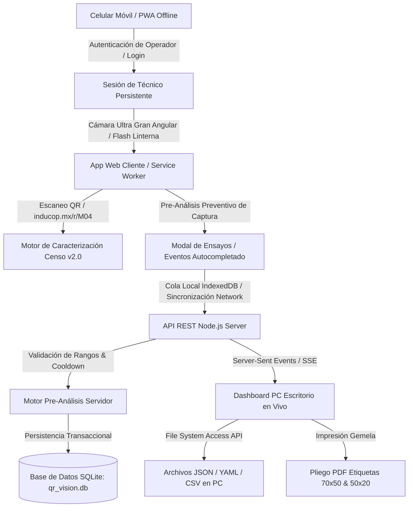

# 📱 Reporte de Proyecto: QR Vision Pro (Fases 1, 2, 3 y 4)

**Fecha de Elaboración**: 3 de Agosto de 2026  
**Proyecto**: Lector & Generador de QR Móvil para Ensayos de Campo (INDUPOX)  
**Ubicación del Código**: `c:\Users\ajmon\proyectos\qr_reader`  
**Repositorio GitHub**: [https://github.com/Entheos69/qr-reader-app.git](https://github.com/Entheos69/qr-reader-app.git)  
**Servidor Nube (Railway)**: [https://qr-reader-app-production.up.railway.app](https://qr-reader-app-production.up.railway.app)  

---

## 📋 Resumen Ejecutivo

El sistema **QR Vision Pro** es una plataforma integral de hardware/software para la lectura, caracterización, bitácora de ensayos y adquisición de muestras de laboratorio y campo de **INDUPOX / INDUCOP**.

En la sesión del **3 de Agosto de 2026 (Fase 4)**, la plataforma evolucionó hacia un **Sistema Ultrarrobusto de Adquisición de Datos en Tiempo Real**, delimitando explícitamente el dominio a la captura e integridad de datos en campo (dejando análisis posteriores fuera del alcance). Se añadieron funcionalidades clave:
1. **Pre-Análisis en Tiempo Real de Captura**: Validación automática de rangos de tolerancia (temperatura y dureza) para alertar al operador preventivamente antes de registrar datos erróneos.
2. **Soporte PWA y Funcionamiento 100% Offline**: Service Worker e IndexedDB para trabajar en naves industriales sin señal y sincronizar automáticamente al recuperar la red.
3. **Persistencia en SQLite Transaccional**: Incorporación de SQLite nativo (`node:sqlite`) sin dependencias npm externas.
4. **Sincronización en Tiempo Real (SSE)**: Transmisión instantánea de datos vía Server-Sent Events desde los celulares en campo al Dashboard de PC.
5. **Control de Hardware (Linterna/Flash)**: Botón de linterna física para entornos con iluminación deficiente.
6. **Exportación Estructurada (CSV / TSV / JSON / YAML)**: Formatos de intercambio limpios para importación directa en sistemas LIMS o Excel.
7. **Seguridad y Autenticación de Operador (Login & Sesión Persistente)**: Modal de inicio de sesión de operador que guarda la identidad del técnico en `localStorage`, asignándola automáticamente a todas las corridas de ensayo y lecturas sin necesidad de definirlo manualmente en cada captura.
8. **Protocolo de Preservación de Continuidad Inter-Agente**: Adopción del manifiesto [`AGENTS.md`](file:///c:/Users/ajmon/proyectos/qr_reader/AGENTS.md) y script de auditoría `scripts/verify_continuity.js` para salvaguardar la interpretabilidad, el POR QUÉ de las decisiones y la memoria transferible entre modelos y herramientas.

---

## 🏗️ Arquitectura General del Sistema



### 1. Backend Servidor (Node.js Nativo + SQLite - 0 Dependencias externas)
- **Servidor HTTP Ligero & SQLite Transaccional**: Módulos estándar `http`, `fs`, `path` y el módulo nativo `node:sqlite` (Node.js v22).
- **Canal de Transmisión SSE (`GET /api/stream`)**: Transmite actualizaciones instantáneas a todos los escritorios conectados sin recargar pantalla (*polling* fallback si se requiere).
- **Motor de Pre-Análisis de Captura**:
  - Valida tolerancias de temperatura (10°C - 50°C) y dureza (0 - 100 Shore).
  - Detecta ensayos recientes en la misma muestra (<60 min) para evitar duplicados por rebote de escaneo.
- **Endpoints API REST**:
  - `POST /api/login`: Registro de inicio de sesión de operador y auditoría.
  - `GET /api/scans` & `POST /api/scans`: Caracterización y registro de escaneos.
  - `DELETE /api/scans/:id` & `DELETE /api/scans`: Limpieza individual o total.
  - `GET /api/events` & `POST /api/events`: Registro de bitácora con flags de pre-análisis.
  - `GET /api/censo` & `POST /api/censo`: Catálogo Censo INDUPOX (CRUD).
  - `POST /api/export`: Exportador a archivos JSON, YAML, CSV y TSV.

---

### 2. Frontend Móvil PWA (Escáner & Adquisición en Campo)
- **Ubicación**: `public/index.html`, `public/app.js`, `public/manifest.json`, `public/sw.js`
- **Autenticación y Sesión de Operador**:
  - Modal de Login de Técnico/Operador con almacenamiento en `localStorage`.
  - Auto-asignación de la identidad del operador a todas las capturas y eventos de ensayo.
  - Botón de gestión de sesión en el encabezado (Iniciar / Cambiar Operador / Cerrar Sesión).
- **Control de Hardware Móvil**:
  - Selector de cámara **Ultra Gran Angular posterior**.
  - Control de **Linterna / Flash** (`MediaStreamTrack` constraints) para zonas oscuras.
  - Botón de **Foto HD Nativa** (`capture="environment"`).
- **Formulario con Pre-Análisis Preventivo**:
  - Banner de aviso en tiempo real que alerta al operador si ingresa un valor fuera de norma antes de enviar.

---

### 3. Superficie de Consulta en Escritorio (Dashboard PC)
- **Ubicación**: `public/dashboard.html`
- **Actualización en Tiempo Real (SSE)**: Refresco instantáneo al recibir escaneos o mediciones desde campo.
- **Columna de Pre-Análisis**: Distintivo visual (`✓ Verificado` / `⚠️ Advertencia`) con detalle explicativo del rango o aviso.
- **Exportación Multiformato**:
  - Exportación individual o en lote a **JSON, YAML, CSV y TSV**.
  - Selección de carpeta destino local con **File System Access API** (`window.showDirectoryPicker()`).

---

### 4. Integración del Censo de Objetos INDUPOX Set v2.0
- **Ubicación**: `data/censo_objetos_v2.json`
- Contiene el catálogo completo de **77 objetos oficiales**:
  - **37 Etiquetas Operativas (70x50)**: `M04`, `M08` a `M22`, `A25` a `M32`, `M38` a `M41`, `M45` a `M52`, `M55` (resina, endurecedor, arcilla, cizalla y notas EPP).
  - **40 Etiquetas de Identidad (50x20)**: `P05` a `P07`, `D13` a `D17`, `F24A/B`, `P33` a `P37`, `U38AC` a `U41TF`, `K44`, `R45` a `R47`, `F42`, `F43`, `F54A/B`, `P56`.

---

### 5. Impresor Aglutinado de Etiquetas PDF
- Generación de pliegos oficiales en **par gemelo (Objeto | Hoja del Cuaderno)** con códigos QR vectoriales y reglas CSS `@media print` para exportación a PDF multi-página.

---

## ⏱️ Hitos y Cronología del Proyecto

1. **Fase 1: Servidor Ligero & Despliegue en Railway (2 Ago 2026)**
   - Servidor HTTP nativo `server.js` desplegado en Railway con certificado seguro **HTTPS**.

2. **Fase 2: Diagnóstico e Investigación de Cámara Trasera (2 Ago 2026)**
   - Selector de cámara Ultra Gran Angular posterior y captura nativa HD.

3. **Fase 3: Sincronización Celular-PC & Dashboard (2 Ago 2026)**
   - Integración Censo INDUPOX v2.0 (77 objetos), bitácora de eventos y exportador JSON/YAML.

4. **Fase 4: PWA Offline, Pre-Análisis de Captura & SQLite (3 Ago 2026)**
   - PWA instalable con Service Worker y cola de sincronización offline.
   - Motor de Pre-Análisis preventivo de rangos de calidad durante la captura.
   - Migración a base de datos transaccional SQLite (`node:sqlite`).
   - Transmisión en tiempo real vía SSE (`Server-Sent Events`).
   - Botón de control de linterna/flash de cámara.
   - Exportador a archivos CSV y TSV para sistemas LIMS.
   - Commit y push a GitHub (`cbd7ff1`) activando el despliegue automatizado en Railway.

5. **Fase 5: Tolerancias Dinámicas, Evidencia Fotográfica HD & Filtros Avanzados (4 Ago 2026)**
   - Motor de Pre-Análisis dinámico con tolerancias de temperatura y dureza específicas por objeto del Censo.
   - Evidencia fotográfica HD comprimida (WebP/JPEG) vinculada a los ensayos en SQLite (`events.foto`).
   - Visor modal de fotos y badge de telemetría de red SSE en Dashboard PC.
   - Barra de filtros avanzados por operador, estado de pre-análisis (Advertencia/Verificados) y rango ISO-8601 de fechas con exportación filtrada.


---

## 📄 Estructura Final del Repositorio

```text
c:\Users\ajmon\proyectos\qr_reader\
├── data/
│   ├── censo_objetos_v2.json      (Base de datos del Censo 77 objetos INDUPOX)
│   ├── events.json                (Historial JSON plano de eventos)
│   ├── qr_vision.db               (Base de datos relacional SQLite transaccional)
│   └── scans.json                 (Historial JSON plano de lecturas)
├── exports/                       (Carpeta destino por defecto para JSON/YAML/CSV)
├── public/
│   ├── app.js                     (Lógica cliente móvil, cámara, offline y pre-análisis)
│   ├── dashboard.html             (Dashboard PC en vivo con SSE, CRUD e impresor PDF)
│   ├── index.html                 (Interfaz web móvil del escáner PWA)
│   ├── manifest.json              (Manifest PWA para instalación en celulares)
│   ├── styles.css                 (Sistema de diseño Glassmorphism & badges)
│   └── sw.js                      (Service Worker para funcionamiento offline)
├── .gitignore                     (Exclusiones de repositorios y SQLite local)
├── package.json                   (Configuración del proyecto Node.js)
├── README.md                      (Guía rápida del usuario)
├── REPORTE_PROYECTO_QR_VISION_PRO.md (Este reporte actualizado)
├── server.js                      (Servidor HTTP REST, SSE y motor SQLite)
└── start.bat                      (Lanzador local independiente)
```

---

## 💡 Ejemplo de Datos de Adquisición Exportados (Pre-Análisis Enriquecido)

```yaml
id: "1785769618515"
timestamp: "1785769618515"
date: "3/8/2026, 9:06:58 a.m."
dispositivo: "Celular Móvil"
caracterizado: "true"
codigo: "M04"
tipo: "OPERATIVA"
nombre: "Mezcla patrón 200 g"
corrida: "corrida 4"
composicion: "120.00 g resina + 80.00 g endurecedor"
tipoEvento: "Medición de Ensayo"
temperatura: "75 °C"
dureza: "65 Shore D"
estadoPreAnalisis: "ADVERTENCIA"
advertencias: "Temperatura fuera de tolerancia norma (75 °C vs 10-50°C)"
operador: "Técnico de Campo"
raw: "https://inducop.mx/r/M04"
```

---

## 📌 Enlaces Útiles

* **Web Móvil PWA (Celular)**: [https://qr-reader-app-production.up.railway.app](https://qr-reader-app-production.up.railway.app)
* **Dashboard PC (Escritorio en Vivo)**: [https://qr-reader-app-production.up.railway.app/dashboard.html](https://qr-reader-app-production.up.railway.app/dashboard.html)
* **Repositorio GitHub**: [https://github.com/Entheos69/qr-reader-app.git](https://github.com/Entheos69/qr-reader-app.git)

---

## 🔒 Bitácora de Cierre de Sesión y Continuidad

### Sesión `2026-08-04` (Fase 5: Protocolo Inter-Agente y Memoria Transferible)
- **Producer Canónico**: `Antigravity` (`2026-08-04-001-Antigravity.yaml` y `2026-08-04-002-Antigravity.yaml`).
- **Gatillo Canónico de Cierre**: Ejecutado mediante la carga de `episteme-minimo` y la sedimentación de características del proyecto.
- **Artefactos Emitidos & Normativa**:
  - Directivas de repositorio [`AGENTS.md`](file:///c:/Users/ajmon/proyectos/qr_reader/AGENTS.md)
  - Kit de habilidades en `.agents/skills/` ([`episteme-minimo`](file:///.agents/skills/episteme-minimo/SKILL.md), [`sedimentar-cs`](file:///.agents/skills/sedimentar-cs/SKILL.md), [`consolidar-aec`](file:///.agents/skills/consolidar-aec/SKILL.md))
  - Paquetes de sedimentación YAML CS:
    - [`exports/2026-08-04-001-Antigravity.yaml`](file:///c:/Users/ajmon/proyectos/qr_reader/exports/2026-08-04-001-Antigravity.yaml) (Protocolo de Continuidad Inter-Agente)
    - [`exports/2026-08-04-002-Antigravity.yaml`](file:///c:/Users/ajmon/proyectos/qr_reader/exports/2026-08-04-002-Antigravity.yaml) (Sedimentación de Características y Desarrollo QR Vision Pro)
- **Estado de Auditoría**: `🚀 CONTINUIDAD Y ESTADO DEL REPOSITORIO EN ORDEN` (`node scripts/verify_continuity.js` OK).
- **Indagaciones Web AEC**: No se realizaron indagaciones exógenas que requirieran consolidación en el Grafo AEC durante este bloque de trabajo.


